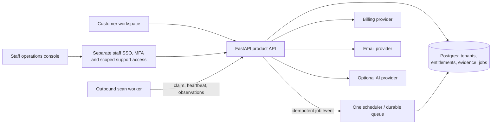

# CYPHWARD platform and business review

**Reviewed and rechecked:** 3 October 2026  
**Scope:** repository architecture, security-sensitive backend paths, product and plan flows, Nigeria-first business fit, and proposed administration, compliance and Academy direction.

## Assessment

CYPHWARD has a credible attack-surface-management starting point: verified-domain onboarding, tenant memberships, a scoring engine, finding and remediation records, and an optional outbound-only scanner worker. The tenant model and separation of scanner observations from Core-side interpretation are good foundations for a small product team.

The product should not yet be sold as a reliable compliance or board-assurance system. Offline probes reproduce two practical account-takeover paths. Scan completeness can be confused with scan success, which can inflate scores and close findings. Public metadata advertises compliance and Academy, while the corresponding app routes currently redirect to other pages; the public fine calculator does not calculate a jurisdiction-specific estimate. There is no billing or plan-entitlement path connecting advertised pricing to server-enforced limits.

The most sensible commercial starting point is a Nigeria-first B2B security product for growing fintechs, payment companies and other digitally exposed, regulated organisations, supported by local security and data-protection partners. Keep the attack-surface product as the technical starting point. Add a narrowly defined compliance workspace around evidence and control owners, then link training to assigned actions. Validate the segment and price with paying pilots before building a broad Africa GRC suite or a consumer training business.

## Highest-priority code findings

P0/P1/P2 below indicate recommended work priority. They are not a claim that every item is an exploitable security vulnerability. Account takeover and result-integrity defects were reproduced in isolated probes during the initial review; code-path findings were traced in source; deployment exposure depends on production configuration; missing admin, billing and compliance capabilities are product gaps. The previous build/test results are recorded below and were not rerun for this documentation recheck. No production compromise has been established.

| Priority | Finding | Why it matters |
|---|---|---|
| **P0 — fix before public account growth** | Registration adopts any existing profile with no password by email, including a Google-authenticated, verified profile. It sets a password and returns a session for the original profile ID. That can give the registrant access to all memberships belonging to the Google user. See [auth.py](/home/consigliere/Desktop/cyphward/backend/app/api/auth.py:318). | **Confirmed in an isolated synthetic-account probe:** registration returned the original profile’s organization-owner session. Require an ownership proof tied to the existing account before attaching another sign-in method. A new email account should complete OTP verification before it can use invitations or create organisations. Make account linking an authenticated, explicit flow. |
| **P0 — fix before public account growth** | Inviting a new email immediately creates its profile and grants it organization membership; registration later adopts the row by matching unverified email. A person who knows that address can claim an outstanding invite before its recipient does. The same risk applies to role changes and owner invitations. See [members.py](/home/consigliere/Desktop/cyphward/backend/app/api/members.py:50). | **Confirmed in an isolated synthetic-account probe:** an unverified registration received the pre-created owner’s organization membership. Create a time-limited invite record instead; deliver an unguessable single-use token to the invited address, require verified email, then add the membership. Preserve existing memberships only when the existing account proves control. |
| **P1 — identity** | Signing out revokes the refresh token only. Issued access JWTs remain valid for their 24-hour lifetime; `get_current_user` also upserts a profile based on token claims, which can recreate a deleted profile. Refresh-token and one-time-code rotation are read-then-update operations without an atomic conditional consume. See [sessions.py](/home/consigliere/Desktop/cyphward/backend/app/core/sessions.py:76), [auth.py](/home/consigliere/Desktop/cyphward/backend/app/core/auth.py:53), and [session.ts](/home/consigliere/Desktop/cyphward/frontend/src/lib/session.ts:1). | **Confirmed:** after logout, the refresh token was rejected but the old access token still loaded the account. Shorten access-token life, add a revocation/session version checked on sensitive requests, make token consume atomic, and keep browser refresh tokens in Secure, HttpOnly, SameSite cookies. Tokens currently live in JavaScript-readable `localStorage`. |
| **P1 — trustworthy scan history** | A cancelled queued/running scan is not fenced from all dispatch paths. In local mode, `execute_recon_local` sets the scan to `running` without first requiring its current status to still be `queued` or `running`. A task already dispatched before cancellation can continue and eventually finalize. | Use conditional compare-and-set transitions. Every stage write, claim, cancel and finalize should verify the current status and claim/lease owner in the same database transaction. Add a regression test for cancel-before-dispatch and cancel-during-scan. |
| **P1 — trustworthy findings** | Baseline diffing can resolve previously open findings simply because their titles are absent from the current run’s observations. Optional `ports`, `tls` and `nuclei` stages intentionally continue after failure. A missing or failed check must not count as proof the issue is fixed. See [inngest_workflow.py](/home/consigliere/Desktop/cyphward/backend/app/workflows/inngest_workflow.py:629). | Track coverage per target and detector; only resolve a finding when the relevant detector completed successfully for the same asset and scope. Record “not evaluated” separately from “clear.” Retain detector/rule IDs as finding identity; mutable titles are poor deduplication keys. |
| **P1 — remediation verification** | `POST /remediation/{id}/verify` rechecks DNS, HTTP and shared security checks, then treats a non-reproduction as fixed. It does not rerun the original detector, so a finding discovered only by Nuclei can be marked verified while Nuclei was never run. See [remediation.py](/home/consigliere/Desktop/cyphward/backend/app/api/remediation.py:195). | **Confirmed using a mocked Nuclei-only task:** a fresh empty security-check result changed it to `verified`. Bind verification to the detector/rule and a fresh complete scan result. If the proof is insufficient, return “inconclusive” and retain the finding as open. Port and dedicated TLS observations also need explicit normalization and verification paths: the current finalizer loads DNS, HTTP and Nuclei observations but does not consume their separate stage payloads. |
| **P1 — trustworthy score and reports** | `compute_risk_score([])` returns 100/100, “Excellent,” and positive claims such as “Strong encryption (TLS 1.3) is active,” whether or not a successful assessment supplied evidence. Overview and report paths can calculate the score from an empty findings list. See [engine.py](/home/consigliere/Desktop/cyphward/backend/app/risk/engine.py:1) and [reports.py](/home/consigliere/Desktop/cyphward/backend/app/api/reports.py:66). | **Confirmed:** no observations still produced a perfect score and a TLS 1.3 claim. Show “not assessed” until a sufficiently complete successful scan exists. Attach evidence and assessment date to each claim, version the scoring model, and distinguish coverage from the risk score. |
| **P1 — processing and database capacity** | The application uses synchronous psycopg operations inside asynchronous workflow and route paths. The global pool allows 20 connections **per process**; when pool checkout fails, `get_db` opens a direct unpooled connection, bypassing that limit. Under saturation, the fallback can amplify connection load rather than apply backpressure. See [database.py](/home/consigliere/Desktop/cyphward/backend/app/core/database.py:34). | Use bounded database access with explicit timeout and backpressure; do not open unlimited direct fallback connections. Move synchronous work out of the event loop or adopt a consistently async driver. Set connection capacity from the Postgres budget and expected application replicas. Add production-like Postgres integration tests. |
| **P1 — worker boundary** | The remote worker posts observations to Core, but `finalize_scan` subsequently performs asset and security-check work in Core. The `/robots.txt` check makes a fresh outbound HTTP request from the API service after the worker completes. See [scanner_jobs.py](/home/consigliere/Desktop/cyphward/backend/app/api/scanner_jobs.py:272) and [security_checks.py](/home/consigliere/Desktop/cyphward/backend/app/scanner/security_checks.py:1). | Define which service owns all outbound target connections. Keep scans within a documented scope, block loopback, link-local and other reserved IP ranges at resolution and connection time, and defend against DNS changes between verification and connect. Do not depend only on the hostname suffix filter. Confirm network egress policy before exposing the scanner as a service. |
| **P1 — scanner network boundary** | Ownership verification and `host_in_scope` constrain discovered hostnames to a customer-owned suffix, but `probe_http_service` follows HTTP redirects and the reviewed DNS/probe path does not reject private, loopback, link-local or metadata-service IPs. A permitted hostname can resolve to a private address, or redirect a probe to a different host. See [http_probe.py](/home/consigliere/Desktop/cyphward/backend/app/scanner/http_probe.py:157) and [scope.py](/home/consigliere/Desktop/cyphward/scanner/scope.py:1). | This is an SSRF risk **if** the scanner/Core network can reach internal services; I did not test a deployed network. Resolve and pin only approved public IPs, revalidate at connect time, and disable or strictly scope redirects. Enforce cloud and worker egress rules that block metadata and private management networks. If private-asset scanning is later a product requirement, make it a separately authorized connector with its own credentials and safeguards. |
| **P1 — durable jobs** | The scheduler runs in each API process by default, while Inngest defines another daily cron path. The scheduler module documents disabling the in-process scheduler when external Inngest cron is registered. The `cron.ran` marker is persisted in Postgres, which helps restart recovery, but checking the marker and selecting/creating scans are separate operations. Multiple API replicas can make the same decision before any writes complete; no atomic scheduler claim prevents duplicate dispatch. FastAPI background tasks also need an explicit recovery mechanism when the API process stops; the remote path includes some lease-based recovery already. | Make one scheduler authoritative, and make job creation idempotent in Postgres with a uniqueness constraint or transactional claim. Send durable work through a queue/worker with retries and dead-letter visibility. Retain leases as crash recovery, not as a substitute for transactional job lifecycle. |
| **P1 — isolation boundary** | Application queries generally add `org_id` filters and no-policy row-level security is enabled on tenant tables in a migration. Those policies protect direct PostgREST roles, but the actual protection of server-side queries depends on which Postgres role `DATABASE_URL` uses; table owners can bypass ordinary RLS unless it is forced. Existing fake-database tests cannot verify production role behavior. | Verify the production connection role, grants, and RLS behavior with a real Postgres integration test for cross-tenant reads and writes. Use a least-privileged application role. Preserve tenant filters as defense in depth. Keep platform-admin queries isolated behind a separately audited access path. |
| **P1 — workspace authorization** | The settings screen contains **organization** members and roles, but there is no distinct internal support/platform-administration role or route. The three organization roles are owner/admin/member; an organization admin should never acquire cross-tenant platform rights. | Add distinct identity scopes and authorization checks before adding global dashboards. See the admin proposal below. |
| **P1 — plan enforcement** | Landing and signup display paid plans, “Sovereign” hosting, domains and enterprise benefits; backend creation does not accept a plan, and scan/domain/report endpoints have no plan-entitlement checks or billing provider flow. In onboarding, the selected plan is sent as `sector`; the backend stores that value as an industry sector while leaving the actual plan at its database default. See [CreateOrganization.tsx](/home/consigliere/Desktop/cyphward/frontend/src/pages/onboarding/CreateOrganization.tsx:7) and [auth.tsx](/home/consigliere/Desktop/cyphward/frontend/src/lib/auth.tsx:454). | Do not treat a UI plan selector or `organizations.plan` text as a commercial entitlement. Model active subscription, billing provider, renewal state, quota and entitlements on the server. Until customer-hosted deployment actually exists and is supportable, remove “runs on your own servers” as a selectable offer or make it an explicitly scoped services engagement. |
| **P1 — tenant relationships** | Tenant-scoped foreign keys such as a report’s `domain_id` are not composite `(org_id, id)` relationships. `POST /reports` checks a supplied domain belongs to the caller’s organization when assembling the report, but the insert still stores the caller’s unchecked `req.domain_id`; `GET /reports` then joins any matching domain to each caller-owned report. This can attach another tenant’s domain name to the report list. See [reports.py](/home/consigliere/Desktop/cyphward/backend/app/api/reports.py:51). | Reject a non-member domain ID; verify it again at insert. Add composite foreign keys and unique constraints for organization-owned relationships where appropriate. Test cross-tenant domain IDs on every create and join path. |
| **P1 — compliance claim integrity** | API and scan records track security observations, not the organisation’s data inventory, privacy impact assessments, policies, control owners, exceptions, staff acknowledgements or verified NDPA compliance. The risk score does not measure legal compliance. | Make the product explicit: security posture can supply **technical evidence** to a compliance programme; it cannot itself certify NDPA compliance or produce a licensed DPCO filing. Keep separate security-risk, assessment-coverage and compliance-readiness measures. |
| **P2 — data lifecycle** | The privacy page describes deletion, retention, organizational isolation and external processors. I did not find a self-service data export/deletion workflow or documented deletion job in the reviewed routes. | Build and document export, closure, retention and deletion paths before selling to organisations that will rely on their data rights. Specify backup expiry and treatment of audit/billing records; test tenant deletion across foreign-key dependants. |
| **P2 — migrations** | `20260922120000_mvp_spec_alignment.sql` intentionally drops the legacy compliance, Academy and related tables with `CASCADE` before aligning the MVP schema. See [the migration](/home/consigliere/Desktop/cyphward/supabase/migrations/20260922120000_mvp_spec_alignment.sql:29). | For a database that has already applied the earlier migrations or accumulated records in those tables, applying this migration permanently discards that legacy product data. Before upgrading an existing customer database, take a restorable backup and explicitly decide whether that data should be exported or transformed. This is not an issue for a fresh database whose discarded modules contain no customer data. |
| **P2 — throttling** | Login, password-reset cooldown and related rate controls are Python-process memory. Multiple replicas do not share them, they reset on restart, and the login dictionary can grow with attempted email addresses. | Apply account, IP and endpoint rate limits at a shared layer; bound and expire limiter state. Add MFA for administrators and credential recovery alerts. |

Two additional findings from the source recheck:

- **P1 — owner protection:** the invitation endpoint protects granting a new owner role, but its membership upsert does not check whether the existing target is already an owner. An organization admin can therefore submit an existing owner's email with a lesser role and reach the SQL that overwrites that membership; the dedicated role-change endpoint would reject this. The role-change endpoint also does not protect the last remaining owner. Unify authorization across both paths, refuse membership changes through invitations, and preserve at least one owner transactionally. This was traced in [members.py](/home/consigliere/Desktop/cyphward/backend/app/api/members.py:67), without a production or real-Postgres execution.
- **P1 — authentication table exposure requires deployment verification:** the own-auth migration creates `auth_sessions` and `password_reset_tokens` without enabling RLS or explicitly revoking Data API role grants. These tables are newer than the migration that enables RLS for the main tenant tables. Exposure depends on the deployed schema, Data API configuration and actual grants; this review has not demonstrated public access. Explicitly isolate these tables and verify their permissions. [Migration](/home/consigliere/Desktop/cyphward/supabase/migrations/20261001120000_own_auth.sql:7), [Supabase table-security documentation](https://supabase.com/docs/guides/database/tables).

## Decisions answering the original questions

| Question | Recommendation |
|---|---|
| Does the platform need architectural improvement? | Yes. Retain React, FastAPI and Postgres; organize the API into clear identity/tenancy, protection, compliance, learning, billing and operations modules. Use separate durable worker processes for scans and other long work. Prioritize ownership checks, transaction boundaries, detector coverage and immutable evidence before introducing more infrastructure. |
| Should there be an admin section? | Yes: expand customer workspace administration and create a separately authorized staff operations console. Customer organization owners must never inherit platform-wide permissions. Include course publishing and compliance-framework review in staff permissions when those modules launch. |
| Can it work as a Nigerian business? | It is a credible business hypothesis, with limited evidence of willingness to pay so far. Start with growing fintechs and businesses serving regulated customers. Sell recurring monitoring, verified remediation and evidence preparation; test delivery with a few paying customers and security/DPCO partners. |
| Should compliance be added? | Yes, after account security and evidence integrity are reliable. Begin with reviewed NDPA/GAID applicability and readiness workflows: processing records, policies, control owners, evidence, gaps, requests/incidents and review/export. Add sector-specific rules only for the institutions to which they apply. |
| Should Academy be added? | Yes, beginning with assigned staff training and practical remediation lessons tied to customer workflows. Add a public practitioner-learning track as a separate commercial offer once content quality, acquisition cost and learner demand are validated. Learners need entry without organization creation or domain verification, and access that reveals no customer scan evidence. |
| What should be built first? | Account/invitation fixes and scan integrity; shared tenant permissions and audit records; a small internal operations console and billing/entitlements; a paid compliance pilot; then Academy assignments and completion evidence. |

These recommendations assume the first revenue goal is B2B subscriptions. A consumer-first Academy would require a different acquisition, pricing and content-production plan. For a pilot, interview approximately ten target buyers, recruit three to five paying design partners, and measure activation, verified issue closure, evidence acceptance, support hours and renewal intent before increasing scope. These are proposed validation steps, not observed customer results.

### Admin section: what it should contain

There are two separate user needs. Keep the current organization’s member, invite and owner actions in workspace Settings. Add an organization-level **Admin** or **Workspace administration** section for people who administer their own team. Build an internal **Platform operations** console for CYPHWARD staff separately. They have different permissions and must never share a global `admin` flag.

**Workspace administration** should include:

- Members, pending invitations, roles, last login and active sessions.
- Role changes, member removal, ownership transfer and enforced MFA for owners/admins.
- Verified domains, permitted scan scope, scan frequency, quota usage and scan cancellation.
- Subscription, invoices, plan limits, integrations and notification ownership.
- Audit events showing who changed each setting and when.
- Separate compliance control owners, course assignments and attestations once those features exist.

Add roles incrementally: `owner` for commercial/legal ownership and recovery; `admin` for workspace configuration; `security_manager` for domain, scan and findings management; `analyst` for triage; `viewer` for read-only access; and a distinct training/compliance role only when the relevant modules launch. Until then, do not add fine-grained roles just for the sake of a larger dropdown. Define an action-to-permission matrix before migrating the current broad admin gate.

**Platform operations** is an internal route or separate staff application, backed by dedicated platform-support assignments rather than customer membership. Start with service and queue health; tenant and subscription lookup; failed or overdue scan review; account suppression/abuse review; email and integration status; and support-request links. Enforce staff SSO and MFA, least privilege, reason capture, time-limited access grants, and an immutable audit event for every tenant-data read or action. Avoid “log in as the customer” as a routine support feature. Where customer-approved troubleshooting access is necessary, make it explicit, time-limited and customer-visible. Do not show cross-tenant scan evidence or personal data on a high-level platform dashboard.

## Architecture direction

Keep a **modular monolith** for the API and product domain while the team validates customers. Existing route and domain modules are enough for a well-separated first version; splitting into services now would add deployment, monitoring and consistency work without solving the actual state and permission problems.

Treat Postgres as the source of truth for identity, tenant boundaries, plan entitlements, durable job state, scan provenance and immutable evidence. A scan run needs a recorded target/scope, detector and template versions, time, coverage and outcome. Treat a partial run as partial; preserve its observations but never use a missing observation to certify that a previous risk disappeared. Generate reports from a consistent, versioned assessment snapshot rather than combining mutable findings with whichever scan ran last.

Store organization-owned resources with tenant-aware constraints as well as route checks. Make every authorization decision on the server. Use bounded pagination and time ranges on findings, scan history, audit logs, reports and raw observations. Put generated report files and larger scan artefacts in private object storage with tenant-scoped access and defined retention; do not grow Postgres JSON blobs without size and retention limits.

Keep payment-provider data and course delivery separate from scanner orchestration. An outbox or transactional job table can connect database state to queue events reliably. Use one authoritative scheduler. Keep AI optional, bounded, and out of deterministic scoring and compliance decisions. CYPHWARD’s privacy notice names cloud AI providers and external email, hosting and database processors, so capture actual vendor, hosting region, retention, and transfer details before making country-specific data-residency promises.

## Product and business assessment: Nigeria first

The buyer hypothesis is credible but not proven: a security lead, CTO, DPO or external security provider at a Nigerian fintech, payment company, bank supplier, healthtech company or growing SaaS company needs to discover exposed public assets, route issues to an owner, and present clear evidence to management, customers or a reviewer. Product interviews and paid pilots should confirm which of those is the urgent budget owner. Do not assume bank procurement is the fastest first sale; regulated banks often require mature vendor assurance, references, procurement cycles and deployment/security evidence.

The product already has Nigerian positioning and naira pricing. The ₦450,000/month Growth and ₦1,850,000/month Scale figures are **unvalidated price hypotheses** in the public page, not evidence of willingness to pay. The page calls the fine illustration an estimated non-compliance fine, but the displayed sector figure is static and does not change with selected country. The underlying regulation lookup labels change, while the fine does not. NDPC’s FAQ describes different maximums for controllers/processors of major and non-major importance, linked to gross revenue; NDPC also says the GAID 2025 came into force on 19 September 2025. The page currently names the NDPA but does not explain that classification or calculate from customer-supplied revenue. Replace this with a sourced, versioned informational illustration or remove it until it can be checked by Nigerian counsel/compliance specialists. Do not use an inaccurate fine figure as the core sales message. Sources: [NDPC GAID 2025](https://ndpc.gov.ng/wp-content/uploads/2025/07/NDP-ACT-GAID-2025-MARCH-20TH.pdf), [NDPC FAQ](https://ndpc.gov.ng/faqs/), and [NDPC annual report 2025](https://ndpc.gov.ng/wp-content/uploads/2026/02/Print_NDPC-Annual-Report-2025-1.pdf).

There is a useful route to a differentiated service model. The Nigerian Data Protection Act provides for licensed DPCOs, and NDPC says compliance-audit returns are filed through a licensed DPCO. CYPHWARD can work with appropriately licensed DPCOs and security consultancies to collect customer-authorized technical evidence, track action owners and deadlines, and export an audit trail. Partner on regulated filing and assurance; do not represent a software score as regulatory approval. Source: [NDPC’s DPCO requirements](https://ftp.ndpc.gov.ng/dpco-registration-requirements/) and [NDPC FAQ](https://ndpc.gov.ng/faqs/).

The competitive frame is broader than vulnerability scanning. **Cybervergent** publicly markets an African-oriented risk and compliance platform with local frameworks, including NDPA, so local positioning alone is not a defensible edge; [Cybervergent product overview](https://www.cybervergent.com/). Established compliance platforms such as [Vanta](https://www.vanta.com/products/audit) sell continuous monitoring and evidence collection, while security products such as [Intruder](https://www.intruder.io/platform/vulnerability-management) market continuous attack-surface and vulnerability coverage. These public product pages establish adjacent offerings, not relative quality, local market share or customer fit. CYPHWARD needs to win on a demonstrated workflow: permissioned discovery → evidence-backed and honest finding → assigned fix → independently verified closure → customer-ready evidence.

For an Africa expansion, “Africa” should be the target market, not one compliance configuration. Treat each country/regulator/framework as a reviewed, versioned content pack with applicability, source URL, effective date, change history and a named reviewer. Begin only where a customer or channel partner has budgeted demand. Nigeria, Kenya and South Africa have different data-protection regimes and sector regulators; a drop-down list of rules is not a compliance feature. The CBN’s 2024 risk-based cybersecurity framework is specifically addressed to deposit money banks and payment service banks under its Banking Supervision Department; do not imply the same applicability to every Nigerian fintech or PSP. Source: [CBN 2024 cybersecurity framework](https://www.cbn.gov.ng/Out/2024/BSD/CBN%20Risk-Based%20Cybersecurity%20Framework%20for%20DMBs%20and%20PSBs_2024.pdf).

## Compliance and Academy product proposal

Start compliance with **NDPA/GAID readiness workflows**, not an expansive “automated compliance” claim. MVP records should include an organisation’s applicability/classification and assigned owner; control statement and source/version; evidence request and source; evidence date, status and reviewer; gap, remediation task and due date; exception/risk acceptance and approval; policy version and staff acknowledgement; audit/export history. Map technical observations only to controls they actually support—for example, an observed missing security header can support a narrow technical evidence item, but it does not establish that an organisation meets an entire privacy safeguard. Keep human assessment and DPCO verification distinct from machine-generated evidence.

Build Academy as a **training and accountability feature** attached to customers’ controls, findings and roles. Prioritize short low-bandwidth modules on security hygiene, phishing response, data handling, incident reporting, privacy and role-specific awareness. Give a workspace admin a way to assign training, set a due date, track completion, collect acknowledgement and export a dated record. Issue a certificate only for completion of a real, versioned curriculum and assessment. Do not suggest CYPHWARD accreditation or CPD credit unless an appropriate accrediting body confirms it.

Academy has a distinct distribution challenge: Nigeria’s NDPC already offers a Virtual Privacy Academy, and free hands-on security education exists from PortSwigger. Sources: [NDPC Virtual Privacy Academy](https://ndpc.gov.ng/virtual-privacy-academy/) and [PortSwigger Web Security Academy](https://portswigger.net/web-security). Differentiate through employer-assigned, locally reviewed, short training whose completion record updates the organisation’s evidence and risk workflows—not a generic standalone course catalogue. The application’s current `/academy` route redirects to `/overview`; do not include it as a current feature until real course and reporting workflows exist.

## Practical order of work

**Immediate, before onboarding more tenants:** close the Google-account and unverified-invite takeover paths; strengthen account linking and invite-token lifecycle; make logout/session revocation and one-time consumption atomic; add regression checks using production-like Postgres roles. Review invitations and access changes made to existing accounts if the service has already been publicly used.

**Next, protect result integrity:** introduce explicit detector coverage and scan provenance; prevent optional-stage failures and incomplete targets from resolving findings; require matching-detector evidence for remediation verification; show “not assessed” instead of 100 for missing assessment data. Make cancellation and every job lifecycle transition conditional and retry-safe.

**Next, make paid plans real:** settle the first buyer and delivery model; implement an authoritative subscription record and server-side entitlements; connect signup and billing to a real plan; publish included scan/domain/team limits and support scope; remove the disconnected plan-as-sector selection. Measure product activation, completed-scan coverage, time to first useful finding, verified-fix rate, weekly active security owners, pilot conversion, retention and support effort.

**Then build the next product modules:** ship the workspace admin foundation and audit trail; run a small paid compliance pilot with a Nigerian DPCO/security partner; attach a short assigned-training pilot to its controls and actions. Only add the next country pack after securing partner review and at least one committed pilot there.

At each step, a pilot should test a customer workflow with a real budget owner, not just users who like the interface. Measure how often a customer discovers an asset they did not know about, whether evidence is accepted by their security/customer-review process, whether assigned fixes are completed and verified, who renews, and how much human onboarding the price must cover. Reassess the published tiers from observed sales and delivery cost; the current code does not yet implement the usage or deployment guarantees those tiers describe.

## Verification and limits

- The repository’s offline backend suite passed: **129 passed**. It uses an in-memory fake database, so it does not prove PostgreSQL, Supabase role, migration, or production concurrency behavior.
- Five isolated synthetic audit probes passed: they reproduced the Google-profile takeover, unverified invitation adoption, usable access token after logout, perfect score without observations, and false remediation verification for a Nuclei-only finding. These probes were created under `/tmp` and are not repository tests.
- The frontend type-check/build and prerender passed with `npm run build`.
- The review was read-only with respect to product code. It did not connect to or scan a deployed environment, validate current production credentials or policies, execute Supabase migrations, or verify actual sales, customer retention, market size or willingness to pay. The workspace had pre-existing modified product files; this review did not change them.
